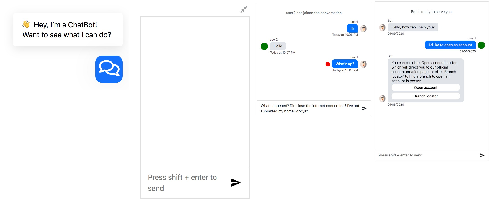

# react-chat-plugin-v2
> react chat plugin with latest features and updates

##### Original repo by leon0707 (not maintained)

This is a clone of https://github.com/leon0707/react-chat-plugin

##### V2 Improvement ✨

1. Added rich text ( `HTML tags support` ) for response text and buttons
2. Added quick reply functionality

>This is an easy-to-use react chat plugin v2.



## Features
1. Simple and clean UI
2. Good for chatbot or person to person chat
3. Two different types of messages: `text` or `notification`
4. Error icon
5. Typing indicator
6. Extendable input area
7. Support new line in the input
8. Keyboard action: `enter` or `shift/control + enter` to send the message

## Install
```shell
npm install react-chat-plugin-v2 --save
```

## Run example
```shell
npm start
```

## Import
```javascript
import ChatBox, { ChatFrame } from 'react-chat-plugin';

state = {
  messages: [
    {
      text: 'user2 has joined the conversation',
      timestamp: 1578366389250,
      type: 'notification',
    },
    {
      author: {
        username: 'user1',
        id: 1,
        avatarUrl: 'https://image.flaticon.com/icons/svg/2446/2446032.svg',
      },
      text: 'Hi',
      type: 'text',
      timestamp: 1578366393250,
    },
    {
      author: { username: 'user2', id: 2, avatarUrl: null },
      text: 'Show two buttons',
      type: 'text',
      timestamp: 1578366425250,
      buttons: [
        {
          type: 'URL',
          title: 'Yahoo',
          payload: 'http://www.yahoo.com',
        },
        {
          type: 'URL',
          title: 'Example',
          payload: 'http://www.example.com',
        },
      ],
    },
    {
      author: {
        username: 'user1',
        id: 1,
        avatarUrl: 'https://image.flaticon.com/icons/svg/2446/2446032.svg',
      },
      text: "What's up?",
      type: 'text',
      timestamp: 1578366425250,
      hasError: true,
    },
  ],
};

handleOnSendMessage = (message) => {
  this.setState({
    messages: this.state.messages.concat({
      author: {
        username: 'user1',
        id: 1,
        avatarUrl: 'https://image.flaticon.com/icons/svg/2446/2446032.svg',
      },
      text: message,
      timestamp: +new Date(),
      type: 'text',
    }),
  });
};

<ChatBox
  messages={this.state.messages}
  userId={1}
  onSendMessage={this.handleOnSendMessage}
  width={'500px'}
  height={'500px'}
/>;
```

### With frame

```javascript
import ChatBox, { ChatFrame } from 'react-chat-plugin';

function Example() {
  const [attr, setAttr] = useState({
    showChatbox: false,
    showIcon: true,
    messages: [
      {
        text: 'user2 has joined the conversation',
        timestamp: 1578366389250,
        type: 'notification',
      },
      {
        author: {
          username: 'user1',
          id: 1,
          avatarUrl: 'https://image.flaticon.com/icons/svg/2446/2446032.svg',
        },
        text: 'Hi',
        type: 'text',
        timestamp: 1578366393250,
      },
      {
        author: { username: 'user2', id: 2, avatarUrl: null },
        text: 'Show two buttons',
        type: 'text',
        timestamp: 1578366425250,
        buttons: [
          {
            type: 'URL',
            title: 'Yahoo',
            payload: 'http://www.yahoo.com',
          },
          {
            type: 'URL',
            title: 'Example',
            payload: 'http://www.example.com',
          },
        ],
      },
      {
        author: {
          username: 'user1',
          id: 1,
          avatarUrl: 'https://image.flaticon.com/icons/svg/2446/2446032.svg',
        },
        text: "What's up?",
        type: 'text',
        timestamp: 1578366425250,
        hasError: true,
      },
    ],
  });
  const handleClickIcon = () => {
    // toggle showChatbox and showIcon
    setAttr({
      ...attr,
      showChatbox: !attr.showChatbox,
      showIcon: !attr.showIcon,
    });
  };
  const handleOnSendMessage = (message) => {
    setAttr({
      ...attr,
      messages: attr.messages.concat({
        author: {
          username: 'user1',
          id: 1,
          avatarUrl: 'https://image.flaticon.com/icons/svg/2446/2446032.svg',
        },
        text: message,
        type: 'text',
        timestamp: +new Date(),
      }),
    });
  };
  return (
    <ChatFrame
      chatbox={
        <ChatBox
          onSendMessage={handleOnSendMessage}
          userId={1}
          messages={attr.messages}
          width={'300px'}
          showTypingIndicator={true}
          activeAuthor={{ username: 'user2', id: 2, avatarUrl: null }}
        />
      }
      icon={<RobotIcon className="Icon" />}
      clickIcon={handleClickIcon}
      showChatbox={attr.showChatbox}
      showIcon={attr.showIcon}
      iconStyle={{ background: 'red', fill: 'white' }}
    >
      <div className="Greeting" style={{ width: '300px' }}>
        👋 Hey, I’m a ChatBot! Want to see what I can do?
      </div>
    </ChatFrame>
  );
}
```

## props
| prop | default | type | required |
| ---- | ---- | ---- | ---- |
| messages | [] | array | N |
| placeholder | "" | string | N |
| userId | null | string/number | Y |
| onSendMessage | null | function | Y |
| timestampFormat | `calendar` | [`calendar`, `fromNow`, `MMMM Do YYYY, h:mm:ss a`] | N |
| width | 400px | string | N |
| height | 60vh | string | N |
| disableInput | false | bool | N |
| disabledInputPlaceholder | "" | string | N |
| showTypingIndicator | false | bool | N |
| activeAuthor | object | null | N |
| onSendKey | null | [`shiftKey`, `ctrlKey`] | N | 

## License

MIT © [Lokesh003Coding](https://github.com/Lokesh003Coding)
